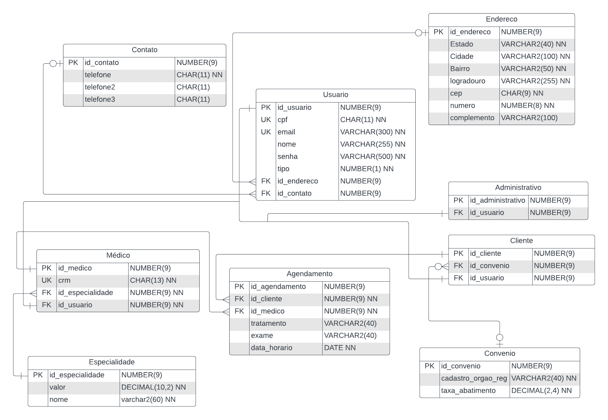

# SafetySoft
<h3> <i> 'Segurança dos dados, e qualidade de vida' </i> </h3>
<h2 style="text-align: center" >Projeto Java para Agendamento e Gestão de Consultas Médicas</h2>

    Este projeto tem como ponto principal, o desenvolvimento de uma aplicação self-hosted para a gerência de agendamentos de consultas médicas.
    Além de contar com funcionalidades como autenticação de usuário, permissões de acesso e manipulação de dados através de uma estrutura integra e atômica garantidos por um banco de dados relacional.

    <strong>O sistema tem como estrutura principal:</strong>
    <ul>
        <li>Usuários administradores</li>
        <li>Usuários médicos</li>
        <li>Usuários clientes</li>
        

        <li>Um administrador consegue criar, listar, editar, e excluir cada um dos cadastros (de usuários e agendamentos);</li>
        <li>Um cliente e um médico conseguem somente visualizar os agendamentos que possuem em seus nomes.</li>
    </ul>

### 🛠 Tecnologias e padrão de projeto
<ul>
    <li>Java >= 11 com JDBC</li>
    <li>Banco de dados Oracle</li>
    <li>Abordagem MVC</li>
</ul>

### Diagrama de Entidade e Relacionamento (Banco de Dados)

### Diagrama de classes (Estrutura do código)

[//]: # (MUDAR)
<a href="docs/Diagrama_de_Classes.png">Clique aqui para visualizar.</a>

#### Vem Ser Trabalho final de Módulo
## Trello da divisão de tarefas:

https://trello.com/b/vdWggPHw/kanban-trabalho-final-mod-2

<h2>Autores</h2> 
<table>
  <tr>
    <td align="center"><a href="https://github.com/matheus1629"> <b>Matheus Palermo</b></a> </td>
    <td align="center"><a href="https://github.com/pedro-s-20"> <b>Pedro Sousa</b></a> </td>
    <td align="center"><a href="https://github.com/Gabriel-Gomes-Meira"> <b>Gabriel Meira</b></a> </td>
  </tr>
</table>

Este projeto foi baseado no seguinte repositório: https://github.com/DaniloTorquatoUbaldine/vemser-trabalho-final

